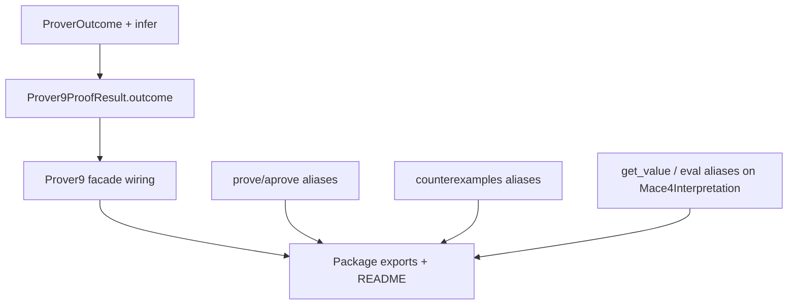

# Plan: API alignment, semantic layer, and ecosystem aliases

This replaces the narrower “Prover9 outcome only” plan. It reflects the **full thread**: align names with **LADR** where they are source of truth, add **de-facto SMT/SAT-style** names as **aliases** so the library is not idiosyncratic, keep **hybrid options** (`*CliOptions` + kwargs), and add **logical result shapes** (outcome/verdict) separate from subprocess **lifecycle**.

## Design principles (locked)

1. **Canonical names stay faithful to tools**: `Prover9`, `Mace4`, `Mace4Interpretation`, `*CliOptions`, `run` / `models` remain the documented primary API.
2. **Aliases for discoverability**: Add mainstream names (`prove`, `counterexamples`, `eval`/`get_value`) as thin wrappers—no duplicate logic paths beyond delegation.
3. **Two layers of status**:
  - **Lifecycle** (`JobLifecycle`): how the wrapper subprocess finished (`succeeded`, `failed`, `timed_out`, `cancelled`, …)—already in `[pyp9m4/jobs.py](c:\Users\u28409265\Documents\pyp9m4\pyp9m4\jobs.py)`.
  - **Semantic outcome** (new for Prover9): what the **log** says about the theorem (`proved`, `not_proved`, `unknown`, plus error/timed_out/cancelled when lifecycle overrides interpretation).
4. **Options**: Keep **typed dataclasses** (`[Prover9CliOptions](c:\Users\u28409265\Documents\pyp9m4\pyp9m4\options\prover9.py)`, `[Mace4CliOptions](c:\Users\u28409265\Documents\pyp9m4\pyp9m4\options\mace4.py)`) + constructor/call-time **kwargs** for frequent fields—document precedence unchanged (`[prover9_facade.py](c:\Users\u28409265\Documents\pyp9m4\pyp9m4\prover9_facade.py)`, `[mace4_facade.py](c:\Users\u28409265\Documents\pyp9m4\pyp9m4\mace4_facade.py)`).

## 1) Prover9: semantic outcome on `Prover9ProofResult`

**Goal:** Option (b) from discussion—a `ProverOutcome` (or `ProverVerdict`) field on `[Prover9ProofResult](c:\Users\u28409265\Documents\pyp9m4\pyp9m4\prover9_facade.py)`, analogous to `sat`/`unsat`/`unknown` vs raw process status.

**Implementation sketch:**

- Add `ProverOutcome` (`str`, enum): at minimum `proved`, `not_proved`, `unknown`, plus `error`, `timed_out`, `cancelled` aligned with non-`succeeded` lifecycles.
- Implement `infer_prover_outcome(parsed, *, lifecycle, exit_code, stdout) -> ProverOutcome` in e.g. `[pyp9m4/parsers/prover9_outcome.py](c:\Users\u28409265\Documents\pyp9m4\pyp9m4\parsers\prover9_outcome.py)`.
- **Precedence:** If `lifecycle != "succeeded"`, set outcome from lifecycle (error / timed_out / cancelled) and do not infer “proved” from partial stdout.
- **Proved:** Strong signal already in tests—`THEOREM PROVED` in `[exit_phrases](c:\Users\u28409265\Documents\pyp9m4\pyp9m4\parsers\prover9.py)` or full stdout (see `[SUBSET_TRANS_TAIL](c:\Users\u28409265\Documents\pyp9m4\tests\test_parsers.py)`).
- **Not proved:** Add substring patterns only after validating against **real** Prover9 logs (e2e or manual corpus). Until then, `succeeded` without `THEOREM PROVED` → `unknown` (documented).

Wire in `_proof_result_from_run`, cancellation synthetic result in `start_arun`, and re-export from `[pyp9m4/__init__.py](c:\Users\u28409265\Documents\pyp9m4\pyp9m4\__init__.py)`.

## 2) Prover9: method aliases (`prove` / `aprove`)

**Goal:** Match “semantic proof attempt” naming (cvc5 `prove`, informal `prove` in ATP) while keeping `run` for subprocess-like drop-in parity.

- `Prover9.prove(...) -> Prover9ProofResult` → delegate to `run(...)`.
- `Prover9.aprove(...) -> Prover9ProofResult` → delegate to `arun(...)`.
- Optionally `start_aprove` → `start_arun` (same handle type).

Docstrings should state: **same behavior and types**; `prove` is naming sugar.

## 3) Mace4: method aliases (`counterexamples` family)

**Goal:** Match “counterexample / finite model” language from SMT (`get_model`) without renaming the canonical `models` API.

- `counterexamples(...)` → `models(...)`
- `acounterexamples(...)` → `amodels(...)`
- `start_acounterexamples(...)` → `start_amodels(...)`

Same signatures, generators, and `Mace4SearchHandle`.

## 4) `Mace4Interpretation`: evaluation aliases

**Goal:** Mirror Z3/PySMT “read value from model” without hiding LADR terms.

- `eval(function: str, *args: int) -> int` as alias of `[value_at](c:\Users\u28409265\Documents\pyp9m4\pyp9m4\parsers\mace4.py)` (note: shadows builtin `eval` in name—consider `**model_eval`** or document that it is a method on the interpretation object, not builtin).
- `get_value(function: str, *args: int) -> int` → alias of `value_at`.
- Optional: `evaluate_relation(name, *args)` or overload doc for `evaluate` on relations → `holds` (only if API stays unambiguous; otherwise skip `evaluate` for relations).

**Naming note:** If avoiding `eval` as method name is preferred, use `**get_value`** + `**apply_function`** or keep `**value_at**` canonical only—call out in plan for implementer to pick one alias pair.

## 5) Optional: Mace4 “search semantic” outcome

**Goal (optional / phase 2):** A second semantic dimension for model search—e.g. “found at least one model” vs “search ended with none” vs “unknown”—**only** if inferrable reliably from parsed output + options.

- Could be a field on a new thin wrapper result, or on `Mace4JobStatusSnapshot` as `search_outcome: ... | None`.
- **Risk:** Mace4 output modes (portable vs standard, pipeline) make this fuzzy; default is **defer** until corpus exists.

## 6) Exports

- `[pyp9m4/__init__.py](c:\Users\u28409265\Documents\pyp9m4\pyp9m4\__init__.py)`: export `ProverOutcome` (and any new public types).
- `[pyp9m4/parsers/__init__.py](c:\Users\u28409265\Documents\pyp9m4\pyp9m4\parsers\__init__.py)`: export `ProverOutcome` and `infer_prover_outcome` if they live under parsers.

## 7) Documentation

- **README**: Short section “Lifecycle vs outcome vs aliases” with a small table.
- **Docstrings**: On `Prover9` / `Mace4` class docstrings, list canonical methods + aliases.
- **Example** (`[examples/pyp9m4_example.py](c:\Users\u28409265\Documents\pyp9m4\examples\pyp9m4_example.py)`): One cell showing `proof.outcome` and optional `interp.get_value(...)`.

## 8) Tests

- New/updated unit tests for `infer_prover_outcome` (golden proved text, failed/timed_out/cancelled mocks).
- Facade tests assert `outcome` on `[test_facade_handles_mocked.py](c:\Users\u28409265\Documents\pyp9m4\tests\test_facade_handles_mocked.py)`, `[test_prover9_facade.py](c:\Users\u28409265\Documents\pyp9m4\tests\test_prover9_facade.py)`.
- E2E: `[test_e2e_binaries.py](c:\Users\u28409265\Documents\pyp9m4\tests\test_e2e_binaries.py)` assert `proved` when applicable.
- Light tests that alias methods call the same code path (e.g. `prove is` or behavior equivalence).

## 9) Non-goals (this plan)

- Full TPTP/SMT-LIB problem AST or multi-solver abstraction layer.
- Renaming `Mace4Interpretation` to `Model` (would break users); aliases and docs only.
- Changing merge semantics for `options=` vs kwargs (already settled).

## Dependency graph (implementation order)

## Files likely touched

| Area                  | Files                                                                                                                                                                          |
| --------------------- | ------------------------------------------------------------------------------------------------------------------------------------------------------------------------------ |
| Outcome inference     | New `pyp9m4/parsers/prover9_outcome.py` (or adjacent)                                                                                                                          |
| Prover9 result/facade | `[pyp9m4/prover9_facade.py](c:\Users\u28409265\Documents\pyp9m4\pyp9m4\prover9_facade.py)`                                                                                     |
| Mace4 facade          | `[pyp9m4/mace4_facade.py](c:\Users\u28409265\Documents\pyp9m4\pyp9m4\mace4_facade.py)`                                                                                         |
| Interpretation        | `[pyp9m4/parsers/mace4.py](c:\Users\u28409265\Documents\pyp9m4\pyp9m4\parsers\mace4.py)`                                                                                       |
| Exports               | `[pyp9m4/__init__.py](c:\Users\u28409265\Documents\pyp9m4\pyp9m4\__init__.py)`, `[pyp9m4/parsers/__init__.py](c:\Users\u28409265\Documents\pyp9m4\pyp9m4\parsers\__init__.py)` |
| Docs / example        | `[README.md](c:\Users\u28409265\Documents\pyp9m4\README.md)`, `[examples/pyp9m4_example.py](c:\Users\u28409265\Documents\pyp9m4\examples\pyp9m4_example.py)`                   |
| Tests                 | `tests/test_prover9_outcome.py` (new), updates to existing facade/e2e tests                                                                                                    |

