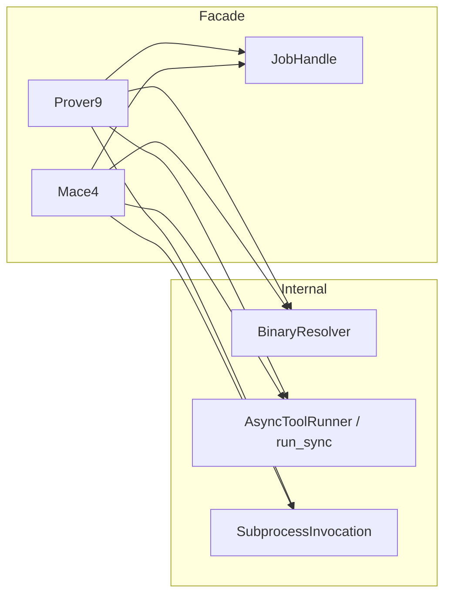

# High-level Prover9 / Mace4 API

## What you confirmed (ground truth)

- **Options**: **Hybrid** — a typed options object for the full surface (today’s `[Mace4CliOptions](pyp9m4/options/mace4.py)` / `[Prover9CliOptions](pyp9m4/options/prover9.py)` renamed or wrapped for the facade), **plus** a small set of **top-level kwargs** for frequent fields, merged through the same validation path as today’s `to_argv()`.
- **Defaults + overrides**: **Constructor** accepts **default** `options=` (and optional default frequent kwargs). Every `**run` / `arun` / `models` / `amodels`** (and any **start-*** background entry) **merges** call-time `options=` / kwargs **over** those instance defaults so you configure once and tweak per invocation.
- **Low-level imports**: **Do not remove** `[BinaryResolver](pyp9m4/resolver.py)`, `[SubprocessInvocation](pyp9m4/runner.py)`, `[RunStatus](pyp9m4/runner.py)`, etc. from the package — but **README and examples should only show** `Prover9`, `Mace4`, parsers/helpers that stay user-facing.
- **Mace4 concurrency**: **Sync generator and async API are equally first-class** — same capabilities (streaming models, optional callback) in both paths.
- **Isomorphism**: **Opt-in flag** (e.g. `eliminate_isomorphic=True`), **default False**; semantically `mace4 | interpformat | isofilter` (using existing `[InterpformatCliOptions](pyp9m4/options/interpformat.py)` / `[IsofilterCliOptions](pyp9m4/options/isofilter.py)` under the hood).
- **Prover9 return**: **Parsed result as the main value**, with **raw stdout/stderr attached for debugging** (not a raw `ToolRunResult` as the primary story).
- **Async status / polling**: **First-class support** for use cases where work runs in the background and callers **poll status** (e.g. **web API**: start proof or countermodel search, client pings for state; **long Mace4 runs**: consume or post-process models as they arrive while **polling** whether a **domain size** is finished or how far the search has progressed).

## Options merge semantics

- **Instance level**: `Prover9(..., options=Prover9CliOptions(...), **default_frequent_kwargs)` and `Mace4(..., options=Mace4CliOptions(...), **default_frequent_kwargs)` establish **baseline** CLI-equivalent settings (timeouts, `eliminate_isomorphic` default, etc. can live here too if exposed on the facade).
- **Call level**: `run(input, *, options=..., **kwargs)` (and the same pattern on `models` / `amodels` / background starters) builds **effective options** as: start from instance defaults, then apply **shallow override** from call-time `options=` (replace whole dataclass if provided, or support `dataclasses.replace`-style merge — pick one consistent rule and document it), then apply **frequent kwargs** last.
- **Precedence** (recommended): `call kwargs` > `call options` fields > `instance default kwargs` > `instance default options`. Document in docstrings so completion-friendly kwargs behave predictably.

## Background jobs and `status()` (async)

Blocking APIs remain useful (`run()`, `await arun()`, `for m in models():`, `async for m in amodels():`). **Additionally**, provide **non-blocking starters** that return a **stable handle** the application can store (e.g. keyed by request id in a web app) and poll:

- `**start_arun` / `start_proof_search` (Prover9)** and `**start_amodels` / `start_model_search` (Mace4)** (exact names TBD): schedule the subprocess on the **current event loop**, return immediately with a `**Job` / `SearchHandle`** (name TBD).
- `**await handle.status()`** (async): returns an **immutable snapshot** suitable for JSON serialization in an API, e.g.:
  - **Lifecycle**: pending / running / succeeded / failed / timed_out / cancelled (expose as **strings** or a small public enum on the facade, not `RunStatus` in user-facing types if we want to hide it).
  - **Progress hints for Mace4**: e.g. `**models_found`**, `**last_domain_size`** (from the most recently parsed `interpretation(n,` if available), optional `**current_size_range**` when `-n`/`-N`/`-i` make a sweep explicit in options — best-effort from parsed output, not guaranteed for all Mace4 modes).
  - **Errors**: truncated stderr tail, exit code when finished.
- `**await handle.wait()`** or `**await handle.result()`** when the caller wants to join; `**handle.cancel()**` (or `await handle.cancel()`) to align with `[AsyncToolRunner](pyp9m4/runner.py)` cancellation.
- **Thread safety**: document that `**status()` must be called from the same asyncio loop** that started the job (typical for FastAPI/Starlette); if cross-thread polling is required later, add a thread-safe queue or `asyncio.run_coroutine_threadsafe` note in docs.

**Web API pattern (illustrative):** POST starts `job = await mace4.start_amodels(...)` and returns `job_id`; GET uses `await registry[job_id].status()` for periodic pings.

**Models + post-processing + pings:** background `start_amodels` can feed an internal queue or invoke `**on_model`** while the client polls `**status()`** for domain sweep / completion without blocking the HTTP worker on the full search.

## Design sketch

### `Prover9`

- **Constructor**: Default `**options=`** and optional **default frequent kwargs**; optional `bin_dir` / resolver overrides (env vars like `LADR_BIN_DIR` unchanged via `[BinaryResolver](pyp9m4/resolver.py)`).
- `**run(...)` / `await arun(...)`**: Merge **instance defaults** with **per-call** `options=` / kwargs; build argv internally; return **parsed + attached raw I/O** as agreed (no `SubprocessInvocation` on the primary result type).
- `**start_arun(...)` → JobHandle**: Background proof run with `**await job.status()`** for polling; `**await job.wait()`** / result when complete.

### `Mace4`

- **Constructor**: Same **default options + kwargs** pattern as Prover9.
- `**models(...)` / `await amodels(...)`**: Merge defaults per call; generator / async generator of models with incremental parse; optional `**on_model`** (sync or async in async path).
- `**start_amodels(...)` → JobHandle**: Same merging rules; subprocess runs in background; `**status()`** exposes lifecycle + **Mace4-oriented progress** (models count, last domain size, best-effort sweep info); consumers still use `**on_model`** or drain an internal queue if we expose one — exact surface to be minimal but sufficient for the two use cases above.
- `**eliminate_isomorphic`**: Instance default **and** per-call override; pipeline wiring unchanged.

### Public exports and docs

- Add `**Prover9`**, `**Mace4`**, **job handle** / **status snapshot** types to `[pyp9m4/__init__.py](pyp9m4/__init__.py)` `__all__`.
- Rewrite `[README.md](README.md)` and `[examples/pyp9m4_example.py](examples/pyp9m4_example.py)` to facade-first: **defaults in `__init__`**, **overrides on run/models**, short **async job + status** example for polling.
- Keep a short “Advanced / low-level” section pointing to `pyp9m4.resolver` / `pyp9m4.runner`.
- Tests: incremental interpretation extraction; **job status transitions** (mocked or short integration); `eliminate_isomorphic` pipeline when binaries exist (`[tests/test_e2e_binaries.py](tests/test_e2e_binaries.py)` patterns).

## Risks / edge cases

- **Portable-format Mace4 output**: streaming may be **interpretation-block only**; portable list remains **batch at EOF** or error if incompatible — document clearly.
- **Early generator break**: should **cancel** the subprocess; background jobs should **cancel** cleanly when the handle is cancelled or garbage-collected (document if weak cleanup only on explicit cancel).
- **Progress fields are best-effort**: domain sweep completion is inferred from options + parsed models / process state, not from undocumented Mace4 internals — document limitations so API consumers do not over-trust `status()` for subtle ordering edge cases.

## Files likely touched

| Area              | Files                                                                                                                                                 |
| ----------------- | ----------------------------------------------------------------------------------------------------------------------------------------------------- |
| Facades + jobs    | New module(s) e.g. `pyp9m4/prover9_facade.py` / `pyp9m4/mace4_facade.py` or `pyp9m4/tools.py` + small `pyp9m4/jobs.py` for shared handle/status types |
| Incremental parse | `[pyp9m4/parsers/mace4.py](pyp9m4/parsers/mace4.py)` or `mace4_stream.py`                                                                             |
| Package surface   | `[pyp9m4/__init__.py](pyp9m4/__init__.py)`                                                                                                            |
| Docs / example    | `[README.md](README.md)`, `[examples/pyp9m4_example.py](examples/pyp9m4_example.py)`                                                                  |
| Tests             | `[tests/](tests/)`                                                                                                                                    |

No change to GPL licensing or binary resolution policy.