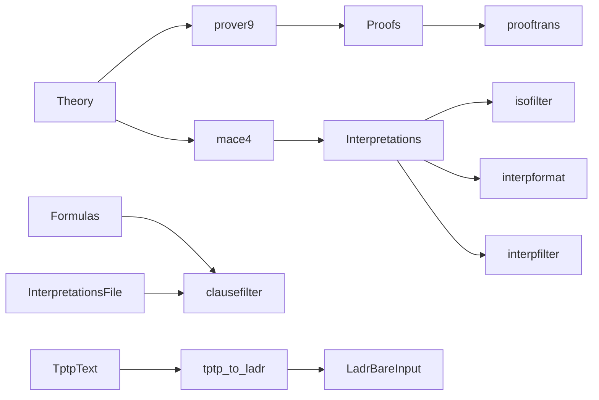

# LADR fluent API redesign

## Current baseline

- Public API is split across `[pyp9m4/prover9_facade.py](pyp9m4/prover9_facade.py)`, `[pyp9m4/mace4_facade.py](pyp9m4/mace4_facade.py)`, `[pyp9m4/pipeline_facades.py](pyp9m4/pipeline_facades.py)`, `[pyp9m4/pipeline.py](pyp9m4/pipeline.py)` (`PipelineBuilder`, streaming pumps), and `[pyp9m4/toolkit.py](pyp9m4/toolkit.py)` (`ToolRegistry`, `arun`).
- `[pyp9m4/resolver.py](pyp9m4/resolver.py)` only knows `prover9`, `mace4`, `interpformat`, `isofilter`, `prooftrans`, `clausetester` (`ToolName` + `_TOOL_STEMS`).
- Parsed models live as `Mace4Interpretation` in `[pyp9m4/parsers/mace4.py](pyp9m4/parsers/mace4.py)`; proofs as `Prover9Parsed` / segments in `[pyp9m4/parsers/prover9.py](pyp9m4/parsers/prover9.py)`.

## 1. I/O type taxonomy (what “pipe compatibility” means)

These are **semantic** types for chaining (stdin/stdout roles follow the [Prover9 manual](https://www.cs.unm.edu/~mccune/prover9/manual/2009-11A/) and [Other LADR programs](https://www.cs.unm.edu/~mccune/prover9/manual/2009-11A/others.html)):

- **Theory** — Full Prover9/Mace4 problem text (including `formulas(...)` / `end_of_list.`, options via `set`/`assign`, etc.). Primary input for `prover9` and `mace4`.
- **Formulas** — Stream or list of formulas/clauses (LADR clause/formula syntax, *not* wrapped in `formulas(..) end_of_list` when the manual calls it a “stream” of objects). Used where a program reads bare formulas from stdin.
- **Interpretations** — Textual stream of `interpretation(...)` terms (as Mace4 / isofilter / interpformat / interpfilter emit). Parsed single objects: `**Interpretation`** with `**Model**` as an alias (likely `Model = Interpretation`, re-exporting today’s `Mace4Interpretation` under the new name or renaming the class in-place).
- **Proofs** — Prover9 log / prooftrans output (stdout). Parsed units TBD; expose iterator `**proofs()`** that can initially yield coarse chunks (e.g. existing `proof_segments` strings or `Prover9Parsed` slices) until a finer proof AST exists.
- **Terms** — Stream of LADR terms (rewriter stdin).
- **Demodulators** — File-backed list of demodulators for `rewriter` (manual: demods file + term stream on stdin).
- **TptpText** / **LadrBareInput** — For `tptp_to_ladr` and `ladr_to_tptp` (stdout of one is stdin of Prover9/Mace4 “bare input” style per manual).

**Helper / side-input types** (not always the “pipe” from the previous stage):

- **InterpretationsFile** — Path to a file containing a *set* of interpretations (no `objects(..) end_of_list` wrapper per manual) for tools like `clausefilter`, `clausetester`, `interpfilter` formula side uses *set* of formulas from a file — mirror that distinction in the API (Path vs wrapped list).




## 2. Binary input/output classification

Below: **stdin**, **file argv**, **stdout** (as the types above). “List” / “stream” follows the manual’s definitions ([others.html](https://www.cs.unm.edu/~mccune/prover9/manual/2009-11A/others.html)).


| Tool                           | stdin                                     | Non-stdin inputs (typical)                    | stdout                                                        |
| ------------------------------ | ----------------------------------------- | --------------------------------------------- | ------------------------------------------------------------- |
| **prover9**                    | Theory (if no `-f`)                       | `-f` theory file(s)                           | Proofs                                                        |
| **mace4**                      | Theory                                    | flags, `-f` optional                          | Interpretations (+ search banner text)                        |
| **interpformat**               | Interpretations                           | mode argv (e.g. `portable`)                   | Interpretations (formatted)                                   |
| **isofilter** / **isofilter2** | Interpretations                           | CLI options                                   | Interpretations                                               |
| **prooftrans**                 | Proofs                                    | CLI options                                   | Proofs                                                        |
| **interpfilter**               | Interpretations stream                    | formulas **file** + test name (`all_true`, …) | Interpretations                                               |
| **clausefilter**               | Formulas stream                           | interpretations **file** + test name          | Formulas                                                      |
| **clausetester**               | Formulas stream                           | interpretations **file**                      | Textual report (treat as **ClausetesterOutput** or plain str) |
| **tptp_to_ladr**               | TptpText                                  | —                                             | LadrBareInput / Theory-like bare file                         |
| **ladr_to_tptp**               | Theory or LADR input                      | `-q` etc.                                     | TptpText                                                      |
| **rewriter**                   | Terms stream                              | demodulators **file**                         | Terms                                                         |
| **renamer**                    | (verify with `renamer -h` in pinned LADR) | often mapping/spec file                       | LADR text (usually Theory-shaped) — confirm against binary    |
| **test_clause_eval**           | (confirm against binary / tarball)        | likely interpretation + clause                | small diagnostic text — classify after inspecting help        |


**Note:** Extend `[BinaryResolver](pyp9m4/resolver.py)` so `resolve(name: str)` works for every stem you ship; widen `ToolName` (or replace with `str` + allowlist) so all of the above are first-class.

## 3. Fluent pipe design (your example)

Target ergonomics:

```python
Theory(assumptions, goals).mace4(max_seconds=60,output_file='mace4.out').isofilter().interpfilter(filter_statements).output()
```

**Implementation sketch:**

- `**Theory`** builds/accepts problem text (constructor: `assumptions` / `goals` as `str | Sequence[str]`, plus optional raw `text=` escape hatch). Renders canonical LADR sections (reuse or add a small builder next to parsers, not in parsers themselves — e.g. new `[pyp9m4/theory.py](pyp9m4/theory.py)`).
- `**Pipe` / `Stage` object** (name TBD) holds: resolver, accumulated argv/env/cwd defaults, **current output type** (enum or `typing.Literal`), optional **materialized stdout** (lazy), and `**output_file`** from the last stage.
- Each **binary class** (e.g. `Mace4`, `IsoFilter`) is either:
  - a namespace of static/instance methods that return a new `Stage`, or
  - methods on `Theory` / `Stage` only when the type checker / runtime allows (see below).

**Typing vs runtime:** Use a generic `Stage[OutKind]` with `typing.overload` or separate subclasses `InterpretationStage`, `ProofStage`, `TheoryStage` so that `.interpfilter(...)` is only valid on `InterpretationStage`. At minimum, use **runtime** checks with clear `TypeError` if the chain is wrong.

**Multi-argument tools** (e.g. **interpfilter**): method signature like `.interpfilter(formulas: Path | Formulas | str, test: Literal[...], **cli)` — creates temp file when given `Formulas` / str list.

`**output_file`:** If set on a stage, tee subprocess stdout to that path (and still pass it to the next process’s stdin when piping). Compose with existing streaming machinery in `[pyp9m4/pipeline.py](pyp9m4/pipeline.py)` / `[pyp9m4/runner.py](pyp9m4/runner.py)`.

### Streaming API: middle ground, script-first names

**Goal:** Scripts and notebooks use **plain synchronous** calls—no `async for`, and **no** `stream_sync` / `interps_sync` style names on the main API.

- **Implementation (internal):** Keep **one async-first path** inside the library (`AsyncToolRunner`, incremental stdout reads, `Mace4InterpretationBuffer`, same pattern as today’s streaming pipeline). Blocking public methods **drain** that path (e.g. `asyncio.run`, or the same helper used by current `run()` / `_sync_run_awaitable`), so behavior stays consistent and there is no duplicated subprocess logic.
- **Default public API (what users type):**
  - `**output()`** — blocking; run to completion; return final stdout `str` (stderr / exit code on a small result object if useful).
  - `**stream()**` — blocking **iterator** (or generator) over stdout chunks or lines as they arrive—users write `for chunk in stage.stream(): ...` without asyncio.
  - `**interps()`** / `**interpretations()**` / `**models()**` — blocking iterators of `Interpretation`, driven by the same incremental parser as streaming stdout.
  - `**proofs()**` — only on Proofs stages; blocking iterator over best-available proof units (`proof_segments` initially); document as **evolving** until a dedicated proof format exists.
- **Optional advanced API:** Expose `**a`-prefixed** counterparts only where needed for apps that already run an event loop (`aoutput()`, `astream()`, `ainterps()`, …), mirroring the existing `arun` / `amodels` split. Document these as secondary; README and examples use the non-`a` names.

## 4. Per-binary facades and aliases

- Keep **one class per binary**, exported from `[pyp9m4/__init__.py](pyp9m4/__init__.py)`.
- **Naming:** `Prover9`, `Mace4`, `InterpFormat` (or keep `Interpformat`), `IsoFilter` with alias `**IsomorphismFilter`**, `IsoFilter2` / `IsomorphismFilter2` if distinct, `ProofTrans`, `InterpFilter`, `ClauseFilter`, `ClauseTester`, `TptpToLadr`, `LadrToTptp`, `Renamer`, `Rewriter`, `TestClauseEval`.
- Each class: mirrors current facade pattern (resolver, timeout, encoding, `*_executable` override) from `[pyp9m4/pipeline_facades.py](pyp9m4/pipeline_facades.py)` but unified through a **shared base** (build `SubprocessInvocation`, run `AsyncToolRunner`, optional tee to `output_file`).
- **CLI options:** extend `[pyp9m4/options/](pyp9m4/options/)` with dataclasses per tool where `-h` is stable; for rarely used tools, allow `extra_argv: Sequence[str]` initially to avoid blocking the redesign on full option parity.

## 5. Migration (no backwards compatibility)

- Replace public exports in `[pyp9m4/__init__.py](pyp9m4/__init__.py)`: `Theory`, `Interpretation`, `Model`, `Proofs` (type/namespace as needed), binary classes, new pipe entry point.
- Refactor or remove: `PipelineBuilder` / `pipeline` / `ToolRunEnvelope` as *the* API (internals can stay for implementation).
- Update **all** tests under `[tests/](tests/)` and examples (`[examples/pyp9m4_example.ipynb](examples/pyp9m4_example.ipynb)`, `[examples/pyp9m4_example.py](examples/pyp9m4_example.py)`) to the new API.
- README: rewrite “Quick start” to show `Theory(...).mace4(...).output()` and one interp chain.

## 6. Verification

- Run full pytest with venv Python; keep or extend `[tests/test_e2e_binaries.py](tests/test_e2e_binaries.py)` to smoke-test any newly resolved binaries present in the pinned LADR release (skip if executable missing).
- For each newly added binary, capture `tool -h` once (dev-only) to validate argv shapes.

## Key files to add or heavily edit


| Area                   | Files                                                                                                                                                                                                      |
| ---------------------- | ---------------------------------------------------------------------------------------------------------------------------------------------------------------------------------------------------------- |
| Types + Theory builder | New `pyp9m4/theory.py`, `pyp9m4/io_kinds.py` (enums), optional `pyp9m4/pipe.py`                                                                                                                            |
| Facades                | Refactor `[pyp9m4/mace4_facade.py](pyp9m4/mace4_facade.py)`, `[pyp9m4/prover9_facade.py](pyp9m4/prover9_facade.py)`, `[pyp9m4/pipeline_facades.py](pyp9m4/pipeline_facades.py)`; add facades for new tools |
| Resolver               | `[pyp9m4/resolver.py](pyp9m4/resolver.py)` — stems for all tools in tarball                                                                                                                                |
| Options                | New modules under `[pyp9m4/options/](pyp9m4/options/)` + `[registry.py](pyp9m4/options/registry.py)` if present                                                                                            |
| Parsers                | Rename/export `Interpretation`/`Model`; optional `proofs()` iterator helper next to `[pyp9m4/parsers/prover9.py](pyp9m4/parsers/prover9.py)`                                                               |
| Tests                  | All `[tests/test_*.py](tests/)` touching facades, pipeline, resolver, CLI help alignment                                                                                                                   |


