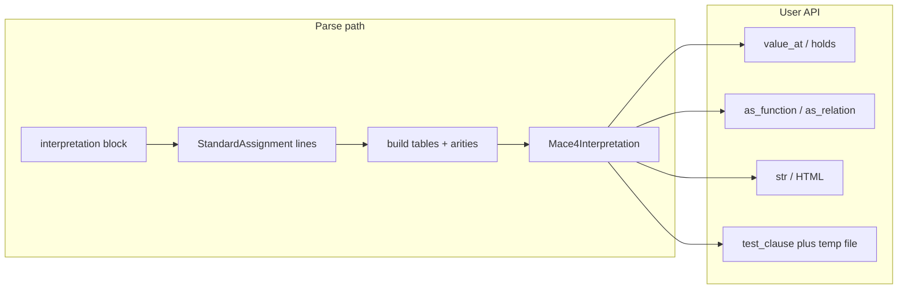

# Enrich `Mace4Interpretation` for inspection, queries, and clausetester

## Current state

- `[pyp9m4/parsers/mace4.py](c:\Users\u28409265\Documents\pyp9m4\pyp9m4\parsers\mace4.py)` defines `Mace4Interpretation` as a small frozen dataclass: `raw`, `domain_size`, `standard_assignments` (each line is `StandardAssignment(kind, rhs)` where `rhs` is the unparsed text after `=` on the right side, e.g. `c1 = 0`, `f(0) = 1`, `R(0,0) = 1`).
- Parsing is line-based regex only; there is no structured map from symbols to tables.
- `[BinaryResolver](c:\Users\u28409265\Documents\pyp9m4\pyp9m4\resolver.py)` today knows `ToolName = "prover9" | "mace4" | ...` but **not** `clausetester`.
- LADR docs: **clausetester** takes a **file** of interpretations and a **stdin stream of formulas** (e.g. `clausetester uc-18.interps < uc-hunt.clauses`) ([Prover9 manual: Other programs](https://www.cs.unm.edu/~mccune/prover9/manual/2009-11A/others.html)).

## Design choices

### 1) Structured tables (built when parsing standard blocks)

Add an internal (or public) immutable structure produced alongside each `Mace4Interpretation` in `_parse_standard_block`:

- **Per symbol metadata**: name → arity (inferred from first occurrence; conflicts → `ParseWarning`).
- **Function map**: `(name, tuple[args]) -> value` (int in domain).
- **Relation map**: `(name, tuple[args]) -> bool` (truth from `= 1` / `= 0` or nonzero vs zero).

**RHS parser** (new helper in `mace4.py` or small `_interpret_parse.py` if it grows):

- Split each `rhs` on the **last** `=` to separate LHS and value token (handles spaces).
- LHS: either `Ident` (0-ary function / constant) or `Ident(arg1, arg2, ...)` with comma-separated arguments at paren depth 0.
- Each argument: trim and parse as **non-negative integer**, with **one level** of redundant parentheses allowed (covers `[test_mace4_interpretation_buffer_nested_parens_in_assignments](c:\Users\u28409265\Documents\pyp9m4\tests\test_parsers.py)` style `R(1,(0))` → args `(1, 0)`).
- Value: int; for relations, treat `!= 0` as true (defensive).

Expose **read-only** views on `Mace4Interpretation`:

- `function_symbols: tuple[str, ...]` / `relation_symbols: tuple[str, ...]` (sorted unique), or richer `functions: Mapping[str, int]` / `relations: Mapping[str, int]` mapping **name → arity** (clearer for `holds` / `value_at`).

Frozen dataclass: add new fields with `repr=False` / `compare=False` if you want equality to remain “same raw + assignments only”, **or** include parsed tables in equality (recommended so two logically identical models compare equal). Pick one and document; default recommendation: **include parsed tables in `__eq__`** once parsing is deterministic.

### 2) API surface (methods on `Mace4Interpretation`)

- `**holds(self, relation: str, *args: int) -> bool**`
  - Require `domain_size is not None`; validate `len(args) == arity(relation)` and `0 <= each < domain_size`.
  - `KeyError` or a small custom error if unknown symbol / missing tuple (pick one style and use consistently).
- `**value_at(self, function: str, *args: int) -> int**`
  - Same validation for functions.
- `**as_relation(self, name: str) -> Callable[..., bool]**` and `**as_function(self, name: str) -> Callable[..., int]**`
  - Return a closure that takes `arity` positional ints (or `*args`) and delegates to `holds` / `value_at`; arity fixed from metadata.
- Optional convenience: `**iter_relation_tuples(name)**` / `**iter_function_entries(name)**` yielding `(args_tuple, value)` for exploration.

All of the above apply to **standard** `interpretation(...)` output only. **Portable** models (`Mace4Parsed.portable_lists`) stay out of scope unless you later add a converter.

### 3) `test_clause`

- **Signature** (illustrative): `test_clause(self, clause: str, *, resolver: BinaryResolver | None = None, clausetester_executable: Path | str | None = None, cwd=..., timeout_s=..., env=...) -> ToolRunResult`
- **Behavior**:
  1. Write `self.raw` to a **temporary file** (ensure trailing newline; keep contents exactly as Mace4 emitted).
  2. Resolve executable: `clausetester_executable` if set, else `BinaryResolver().resolve("clausetester")`.
  3. Run `[run_sync](c:\Users\u28409265\Documents\pyp9m4\pyp9m4\runner.py)`(`SubprocessInvocation(argv=(exe, tmp_path), stdin=clause, text=True, timeout_s=...)`).
  4. Delete temp file in `finally`.
- **Resolver**: extend `[ToolName](c:\Users\u28409265\Documents\pyp9m4\pyp9m4\resolver.py)` and `_TOOL_STEMS` with `"clausetester": "clausetester"`. **Implementation step**: confirm `clausetester` exists under the pinned release’s `bin/` (same layout as other tools); if the Windows/Linux/mac assets omit it, document that users must install full LADR or set `LADR_BIN_DIR` / pass `clausetester_executable`.

### 4) Pretty printing

- `**__str__`**: human-readable multi-section text — domain size, list of function/relation symbols with arity, then **operation tables**:
  - arity 0: one line `symbol -> value`
  - arity 1: single column or row
  - arity 2: ASCII grid (row = first arg, col = second) with aligned cells
  - arity ≥ 3: enumerate tuples (compact) or labeled sections (avoid huge default output; optional `max_rows=` on a dedicated `format_tables()` if needed)
- `**__repr__`**: short, unambiguous summary (domain, counts of funcs/rels) so containers of interpretations stay readable.
- **Jupyter / IPython**:
  - Implement `**_repr_html_`**: minimal HTML/CSS tables (one table per symbol for arity ≤ 2; list for higher).
  - Optionally `**_repr_pretty_`** for IPython’s plain-text pretty printer when HTML is disabled.

## Files to touch

| File                                                                                           | Change                                                                                                                                                                                                                         |
| ---------------------------------------------------------------------------------------------- | ------------------------------------------------------------------------------------------------------------------------------------------------------------------------------------------------------------------------------ |
| `[pyp9m4/parsers/mace4.py](c:\Users\u28409265\Documents\pyp9m4\pyp9m4\parsers\mace4.py)`       | RHS parser; extend `Mace4Interpretation` with table fields + methods; `__str__` / `_repr_html_` / optional `_repr_pretty_`; `test_clause` (imports: `tempfile`, `Path`, `BinaryResolver`, `SubprocessInvocation`, `run_sync`). |
| `[pyp9m4/resolver.py](c:\Users\u28409265\Documents\pyp9m4\pyp9m4\resolver.py)`                 | Add `clausetester` to `ToolName` and `_TOOL_STEMS`.                                                                                                                                                                            |
| `[pyp9m4/parsers/__init__.py](c:\Users\u28409265\Documents\pyp9m4\pyp9m4\parsers\__init__.py)` | Re-export any new public types if added.                                                                                                                                                                                       |
| `[tests/test_parsers.py](c:\Users\u28409265\Documents\pyp9m4\tests\test_parsers.py)`           | Unit tests: parsing tables, `holds`/`value_at`, arity errors, `R(1,(0))`, string/HTML smoke (HTML contains `<table` or symbol names).                                                                                          |
| Optional e2e                                                                                   | If CI has binaries: `test_clause` smoke with a trivial clause; else mock `subprocess` / skip if executable missing.                                                                                                            |

## Testing strategy

- Pure tests for table parsing and query methods using existing corpus strings in `test_parsers.py`.
- Golden-style snippets for `__str__` (stable layout) or substring assertions.
- `test_clause`: either **pytest skip** when `clausetester` not resolvable, or monkeypatch `run_sync` to assert argv/stdin.

## Risks / follow-ups

- **Non-standard or partial assignments** in the wild: document that missing entries raise or are treated as false/undefined (recommend: explicit error for unknown tuple).
- **Portable format**: not covered; could add `Mace4Interpretation.from_portable(...)` later.
- **clausetester availability** in minimal distributions must be verified against the actual pinned artifact layout.

