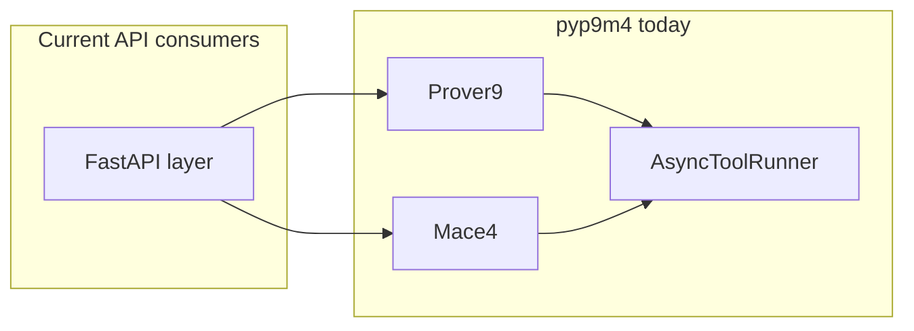

# pyp9m4: API-oriented orchestration and state

## Baseline (today)

- `**[pyp9m4/resolver.py](pyp9m4/resolver.py)**` already defines `ToolName` (`prover9`, `mace4`, `interpformat`, `isofilter`, `prooftrans`, `clausetester`).
- `**[pyp9m4/runner.py](pyp9m4/runner.py)**` provides `AsyncToolRunner` with `run` and `stream_events` (stdout/stderr line events + optional `parse_hook` domain events).
- `**[pyp9m4/prover9_facade.py](pyp9m4/prover9_facade.py)**` / `**[pyp9m4/mace4_facade.py](pyp9m4/mace4_facade.py)**` duplicate patterns: `_JobState`, `start_arun` / `start_amodels`, manual `asyncio.Task` + `asyncio.Event`. Mace4’s isomorphic path hardcodes `mace4 → interpformat → isofilter` in `[_arun_isomorphic_pipeline](pyp9m4/mace4_facade.py)`.
- `**[pyp9m4/jobs.py](pyp9m4/jobs.py)**` exposes snapshot dataclasses and `job_status_snapshot_to_json_dict`; no UUID registry or TTL.
- `**[pyp9m4/options/registry.py](pyp9m4/options/registry.py)**` is for CLI help alignment tests, not runtime dispatch.
- **Dependencies** (`[pyproject.toml](pyproject.toml)`): no Pydantic; keep core dependency-light unless you opt into an extra.




---

## 1. Unified `ToolRegistry` and `arun(program, input, options)`

**Goal:** Single entry point so an HTTP API can pass `program: "prover9" | "mace4" | ...` without a large `if/elif`.

**Design:**

- Add a new module, e.g. `[pyp9m4/toolkit.py](pyp9m4/toolkit.py)` or `[pyp9m4/unified.py](pyp9m4/unified.py)`, exporting:
  - `ToolRegistry`: maps each `ToolName` to a small descriptor (how to build argv, stdin expectations, how to produce a **typed result**).
  - `async def arun(program: ToolName | str, input: ..., options: Mapping | None = None, *, resolver: BinaryResolver | None = None, **facade_kwargs) -> ToolRunEnvelope` where `ToolRunEnvelope` is a tagged union or a single dataclass with `program`, `raw: ToolRunResult`, and optional parsed payloads (`Prover9ProofResult`, Mace4 interpretations, `PipelineTextResult`, etc.).

**Implementation notes:**

- Reuse existing `_build_inv` / result builders by delegating to `Prover9`, `Mace4`, and new facades (item 5) rather than duplicating argv logic.
- Normalize string program names (case, aliases) against `ToolName`.
- For `mace4`, clarify semantics: `arun` likely means “run to completion and return all parsed models” (matching batch behavior) vs streaming; document that streaming stays on `Mace4.amodels` / handles.

**Exports:** Wire into `[pyp9m4/__init__.py](pyp9m4/__init__.py)` selectively (`arun`, `ToolRegistry`, result types).

---

## 2. Native `JobManager`

**Goal:** Centralize UUIDs, task tracking, cancellation, snapshots, optional TTL—replacing ad-hoc “delivery manager” logic in the web project.

**Design:**

- New module e.g. `[pyp9m4/job_manager.py](pyp9m4/job_manager.py)`:
  - `JobManager` holds `dict[UUID, JobRecord]` where `JobRecord` includes: `task: asyncio.Task`, optional handle reference, last `status` snapshot, created_at, optional `result` blob.
  - Methods: `start(coro_factory | handle_factory) -> UUID`, `get(uuid)`, `status(uuid)`, `cancel(uuid)`, `list()` (optional filters).
  - **Persistence:** default **in-memory only**; optional `persist_path: Path | None` to append JSONL or sqlite **if you need survive restarts** (start with in-memory + clear interface so persistence can be added without breaking callers).
  - **Auto-cleanup:** background `asyncio.create_task` loop or lazy eviction on access: drop records older than `ttl_s` after terminal state.

**Refactor path (minimize churn):**

- Implement `JobManager` generically first.
- Optionally add `Prover9.start_arun(..., job_manager: JobManager | None = None)` that registers the returned handle—*or* keep facades unchanged and let the API do `jm.register(handle)` via a thin adapter. Prefer **adapter** in v1 to avoid widening every facade signature.

**Related types:** Extend or unify `[pyp9m4/jobs.py](pyp9m4/jobs.py)` with a generic `JobStatusSnapshot` or keep per-tool snapshots but add `job_id` + `program` on the manager side.

---

## 3. Async `event_stream()` as `AsyncIterator[dict]` (SSE-friendly)

**Goal:** Yield typed, JSON-serializable events: `stdout`, `stderr`, `model_found`, `lifecycle_change`.

**Design:**

- Define a small **event schema** (TypedDict or dataclasses with `to_dict()`):
  - `{"type": "stdout", "line": "..."}` / `stderr`
  - `{"type": "model_found", "model": {...}}` (use existing `Mace4Interpretation` serialization—see item 7)
  - `{"type": "lifecycle_change", "phase": "running" | ...}`
- Add `async def event_stream(self) -> AsyncIterator[dict[str, Any]]` to:
  - `Prover9ProofHandle` and `Mace4SearchHandle` (and any new unified handle type).

**Implementation:** Bridge from existing `AsyncToolRunner.stream_events` + Mace4’s `parse_hook` (already emits interpretation tuples) by mapping internal events to the dict schema. Ensure **one consistent ordering** (interleave stdout/stderr with parsed models).

---

## 4. Loose option ingestion: `from_any_dict` / `from_nested_dict`

**Goal:** Accept raw request bodies like `{"max_seconds": {"value": 10}}` without manual unwrapping in the API.

**Design:**

- Add `[pyp9m4/options/ingest.py](pyp9m4/options/ingest.py)` with:
  - `unwrap_gui_value(v: Any) -> Any` — if `v` is `dict` with a single known key (`value`, `default`, …) or Pydantic-like `.model_dump()` output, return the scalar or recurse.
  - `coerce_mapping(flat: Mapping[str, Any], field_names: frozenset[str]) -> dict[str, Any]` — maps aliased keys if needed later.
- Add `**@classmethod from_nested_dict(cls, data: Mapping[str, Any] | None) -> Self`** on each of:
  - `[Prover9CliOptions](pyp9m4/options/prover9.py)`, `[Mace4CliOptions](pyp9m4/options/mace4.py)`, `[InterpformatCliOptions](pyp9m4/options/interpformat.py)`, `[IsofilterCliOptions](pyp9m4/options/isofilter.py)`, `[ProofTransCliOptions](pyp9m4/options/prooftrans.py)`
- Implementation strategy: build a `dict` of field name → unwrapped value, then `cls(**{k: v for k, v in merged.items() if k in fields})` with type coercion (int/bool/str) and **ignore unknown keys** with optional `warnings` list or strict mode flag.

**Tests:** Table-driven tests for nested `value` wrappers and flat dicts (parity with direct construction).

---

## 5. First-class facades: `Isofilter`, `Interpformat`, `Prooftrans`

**Goal:** Same ergonomics as `Prover9` / `Mace4`: typed options, `arun`, parsed output.

**Design:**

- New modules or a single `[pyp9m4/pipeline_facades.py](pyp9m4/pipeline_facades.py)`:
  - Each class: `BinaryResolver`, default `*CliOptions`, `_build_inv`, `async def arun(stdin: str | bytes | None, *, options=...) -> PipelineToolResult`.
  - `PipelineToolResult`: stdout, stderr, exit metadata, plus **structured** fields where parsers exist (`[parse_pipeline_tool_output](pyp9m4/parsers/pipeline.py)`, `[inspect_pipeline_text](pyp9m4/parsers/pipeline.py)`); extend parsers if prooftrans needs stronger structure later.
- Register these in the unified `ToolRegistry` / `arun`.

---

## 6. Fluent pipeline / chaining API

**Goal:** Express `input → mace4 → isofilter → interpformat` (or reorder) without manual string plumbing.

**Design sketch:**

```python
result = await (
    pyp9m4.pipeline(input_text)
    .run("mace4", opts)
    .pipe("isofilter", iso_opts)
    .pipe("interpformat", ifc_opts)
    .execute()
)
```

- Implement a `**PipelineBuilder**` class:
  - Holds current text/bytes output, resolver, cwd/env, timeout.
  - `.run(tool, options)` runs one stage; `.pipe(tool, options)` uses previous stdout as stdin.
  - `.execute()` returns a `**ChainResult**` (per-step `ToolRunResult` or summaries + final parsed payload).
- **Compose with** Mace4’s existing isomorphic path: either delegate to `_arun_isomorphic_pipeline` when the chain matches that triple, or keep builder fully generic (simpler to reason about).

---

## 7. Native serialization: `to_dict()` / optional Pydantic

**Goal:** Web frameworks get JSON without hand-rolled `asdict` glue.

**Design (recommended):**

- Add `**to_dict()`** on all public result/snapshot dataclasses (`Prover9ProofResult`, `Mace4JobStatusSnapshot`, `ToolRunResult`, pipeline results, `ChainResult`), implemented via a shared helper (same tuple→list behavior as `[job_status_snapshot_to_json_dict](pyp9m4/jobs.py)`).
- Keep `**job_status_snapshot_to_json_dict`** as a thin alias or deprecate in favor of `.to_dict()` on snapshots.
- **Optional extra** `[pydantic]` in `pyproject.toml`: provide parallel Pydantic v2 models *or* use Pydantic’s dataclass integration—only if you need validation at HTTP boundaries; **not required** for the core library.

---

## Testing and CI

- Unit tests: `options/ingest`, `ToolRegistry` dispatch, `JobManager` TTL/cancel, `event_stream` dict shapes, pipeline builder (mocked `AsyncToolRunner` where possible).
- Integration tests (existing pattern in `[tests/test_e2e_binaries.py](tests/test_e2e_binaries.py)`): one happy path per new facade and one full chain.

---

## Backward compatibility

- All changes should be **additive** unless you explicitly refactor facades to call shared internals; existing `Prover9` / `Mace4` imports and methods remain stable.
- New symbols exported from `[pyp9m4/__init__.py](pyp9m4/__init__.py)` only after names are finalized (avoid churn for downstream `[Prover9-Mace4-Web](https://github.com/jamiewannenburg/Prover9-Mace4-Web/tree/api)`).

---

## Suggested implementation order

1. `**to_dict()` helper + snapshot/result methods** — unblocks API JSON work everywhere.
2. `**from_nested_dict` on CLI options** — independent, high value for the web API.
3. **Pipeline tool facades + `ToolRegistry` / `arun`** — core simplification.
4. `**JobManager` + optional registration adapter** — replaces manual UUID/task maps.
5. `**event_stream` dict iterators** — builds on runner + handles.
6. **Fluent `PipelineBuilder`** — composes facades and registry.

