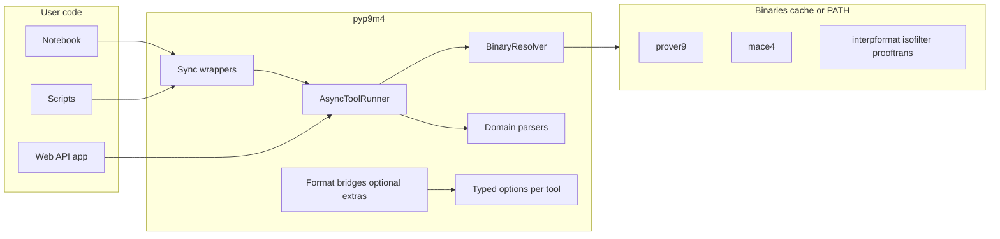

# pyp9m4: Prover9/Mace4 Python wrapper

## Goals (locked from interview)

- **v1 executables**: `prover9`, `mace4`, `interpformat`, `isofilter`, `prooftrans` (not the entire LADR `bin/` yet).
- **Binary distribution**: **combo** — default automatic fetch from GitHub Releases into a user/package cache, with **override** via environment variables and/or explicit paths (no reliance on a single global install path).
- **Concurrency model**: **async primary** (`asyncio` subprocess + streaming); **sync** as thin wrappers (`asyncio.run` or `run_in_executor` where appropriate for notebooks blocking style).
- **Parsing**: **domain objects in v1** — e.g. Mace4 interpretation tables / assignments where stable, Prover9 run statistics + proof text regions; defer full proof-step AST to a later milestone.
- **Options documentation**: **hand-curated** typed APIs (dataclasses / Pydantic-style models TBD) with **CI validation** that they stay aligned with each binary’s `--help` output (and optionally `--version`).
- **Streaming**: **both layers** — low-level stdout/stderr line (or byte) streams **and** optional higher-level parsed iterators where parsers can incrementally recognize structure.
- **TPTP / SMT-LIB**: **bridge_libs** — optional extras and clear docs for composing with common Python stacks; avoid hard dependency on one solver unless gated as an extra.
- **License / packaging**: **GPL-2.0** acceptable for the wrapper; binaries treated as **separate artifacts** (downloaded), not necessarily vendored inside the wheel.
- **Testing**: **real binaries** in CI — download release assets per OS, run **small end-to-end** examples plus unit tests for option mapping and parsers.

## Non-goals for v1

- Shipping a web GUI or FastAPI app inside this repo (the wrapper should be **backend-suitable** only).
- Complete proof object graph for every Prover9 output mode (explicitly later).

## Architecture (high level)

### 1. Binary resolution and installation

- Implement a **resolver** module that:
  - Determines **platform key** (OS + arch, e.g. `windows-amd64`, `linux-amd64`, `macos-arm64`) — exact keys must be **derived from actual release asset names** in [jamiewannenburg/ladr releases](https://github.com/jamiewannenburg/ladr) (inspect release assets during implementation; support a small **explicit mapping table** in code).
  - Downloads and extracts a **pinned version** (e.g. from package `__version__` or a dedicated `BINARIES_VERSION` constant) into a cache dir (e.g. `platformdirs` user cache).
  - Honors overrides: e.g. `PROVER9_HOME`, `MACE4_HOME`, or a single `LADR_BIN_DIR` / per-tool paths — **exact names** to be chosen for clarity and documented.
- **Security**: verify checksums if the release provides them; otherwise document **trust model** (GitHub HTTPS + pinned tag).

### 2. Execution and API shape

- **One pattern per tool**: e.g. `async def run_prover9(job: Prover9Job, ...) -> Prover9Result` where `Prover9Job` holds inputs (files / strings), **typed options**, timeouts, and stream preferences.
- **Statuses**: explicit enum-like states for the **lifecycle** of a run: `pending`, `running`, `succeeded`, `failed`, `timed_out`, `cancelled` (adjust if you prefer fewer states — implementation detail).
- **Results**: immutable result objects with:
  - `status`, `exit_code`, `duration`, paths or blobs for captured outputs
  - **Parsed domain payload** when parsing succeeded (partial success allowed: raw text + parse warnings)
- **Streaming**:
  - **Layer A**: async iterables of `stdout`/`stderr` lines (or bytes) with optional tee-to-file paths.
  - **Layer B**: optional `parse_stream=True` that yields **events** (`StatLine`, `ProofFragment`, `ModelSection`, etc.) — best-effort, with clear typing for “unparsed tail”.

### 3. Hand-curated options + validation

- For each of the five tools, define **Python types** mirroring CLI flags (grouped logically: search, printing, limits, I/O).
- Add a **dev/CI** step that shells out to each binary with `--help`, normalizes whitespace, and **asserts** that every documented flag in code appears in help output (and flags removed from upstream are caught). This gives you maintainable docs **without** sacrificing drift detection.

### 4. Domain parsers (v1 scope)

- **Prover9**: parse common summary blocks (e.g. clauses generated, proofs found, exit conditions) and **segment** proof output into manipulable strings/structures; avoid promising full inference rule objects until a later release.
- **Mace4**: parse **finite model output** into tabular / mapping structures where the format is stable; document limitations.
- **interpformat / isofilter / prooftrans**: often **pipeline** tools — expose **stdin/stdout** and file-based workflows explicitly; parsers may be thinner (structured exit + output text).

### 5. TPTP and SMT-LIB “integration”

- Provide **optional modules** or extras:
  - **TPTP**: helpers to read/write problem files and translate **to/from** Prover9 input conventions where feasible; reference common community packages in docs (actual import names pinned in `optional-dependencies` when you adopt them).
  - **SMT-LIB**: stay at **format boundaries** by default (e.g. export/import strings or files); optional **bridge** to libraries like PySMT/Z3 only behind an extra to keep core install light.

### 6. Packaging layout (suggested)

- Package name / import: `**pyp9m4`** (per your choice).
- `pyproject.toml`: core deps minimal (`platformdirs`, typing helpers if needed); **extras** for bridges and dev (`pytest`, `pytest-asyncio`, maybe `httpx`/`aiohttp` if using GitHub API for releases).
- **No markdown files** beyond what you explicitly want later — README only when you ask for it (user rule: avoid unsolicited docs).

### 7. CI strategy (real binaries)

- Matrix: **Windows + Linux + macOS** (or a subset if cost is an issue — start with Linux + Windows if needed).
- Steps: download the **same release asset** the resolver uses, run 2–3 **tiny** problems (prover9 proof, mace4 model, one pipeline through `prooftrans` or `interpformat`).
- Cache downloaded archives between runs.

## Risks and mitigations

- **Release asset naming drift**: centralize mapping in one module + CI failure when a platform is missing.
- **Output format fragility**: version-gate parsers on **binary version**; surface `ParseWarning` instead of failing hard.
- **Async in notebooks**: document `await` usage in asyncio-enabled environments; sync API for classic notebooks.

## Implementation order (suggested)

1. Resolver + cache + env overrides + version pinning.
2. Async runner + sync shims + file/tee streaming + statuses/results skeleton.
3. Typed options for **prover9** and **mace4** + `--help` validation harness.
4. Domain parsers for Prover9/Mace4 v1.
5. Add **interpformat**, **isofilter**, **prooftrans** wrappers (thinner parsers, pipeline ergonomics).
6. Optional extras + TPTP/SMT bridge stubs and docs **when you request markdown** or docstrings-only policy as you prefer.

